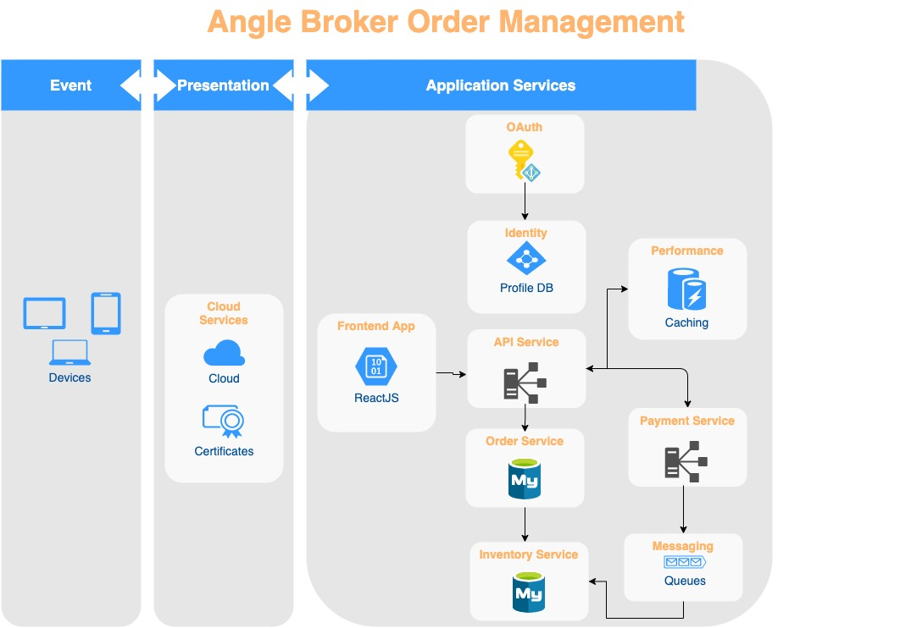
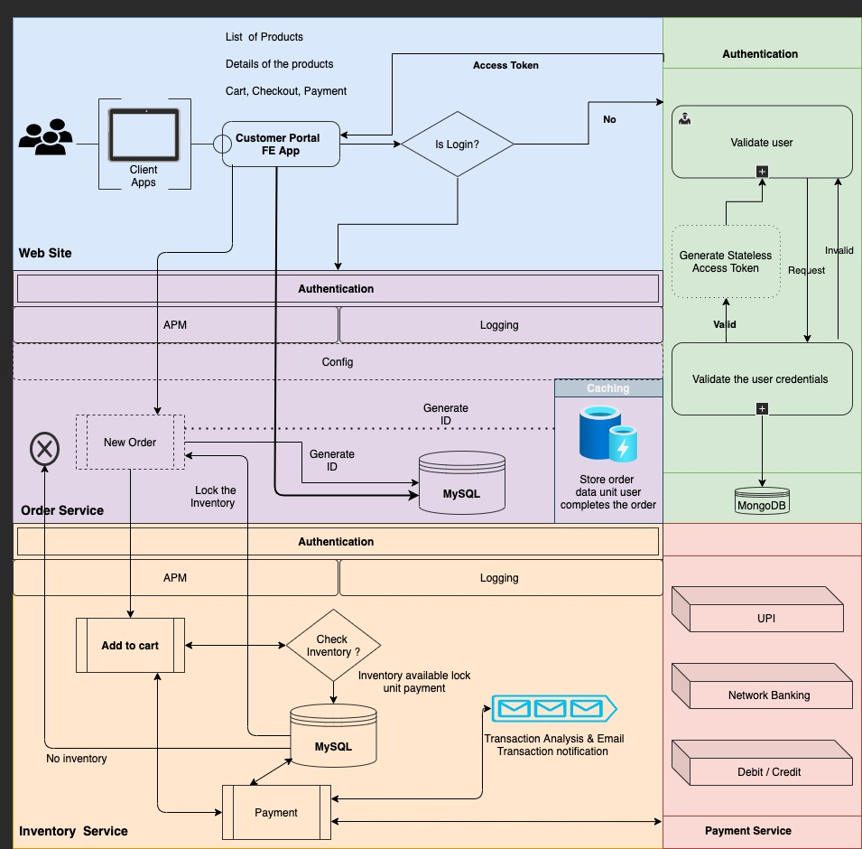
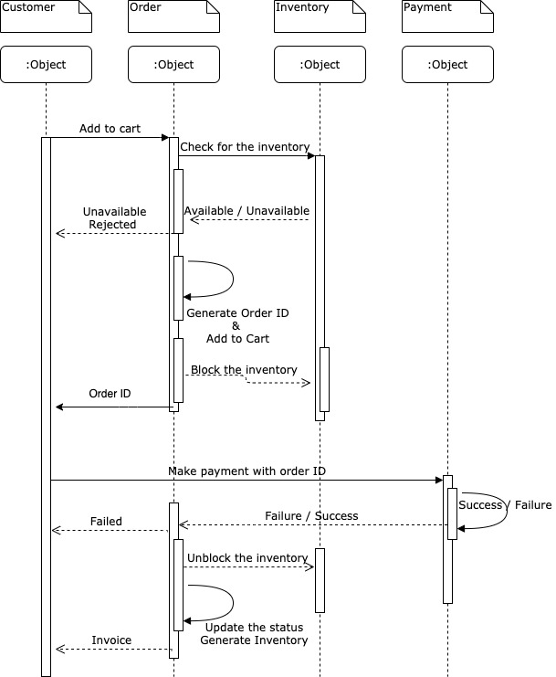

# Angle Broking Inventory Order System

## Business Requirements

**Problem Statement**

* A quantity is allocated to users who completes the payment
* No more than 10 quantity can be allocated 
* Focus is to be given on solving the race condition that will arise when 10, 000 users race to get only 10 quantities

## Approach

Multiple microService are defined, each service have there own responsibility. Below are the service that required

1. FE ReactJS Application
2. Product Service 
3. Order Service
4. Inventory Service 
5. Payment Service

> Note: Currently I have created all the micro service in Mono Repo pattern with different MicroService using DDD (Domain Driven Design) 

## Architecture level

## High level

## Flow Diagram

